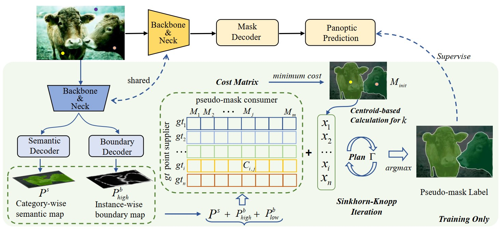
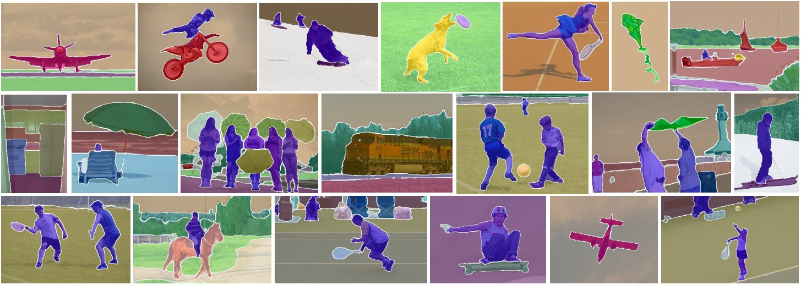

# Point2Mask: Point-supervised Panoptic Segmentation via Optimal Transport
> [Wentong Li](https://cslwt.github.io/), Yuqian Yuan, Song Wang, Jianshu Li, Jian Liu, [Jianke Zhu](https://person.zju.edu.cn/jkzhu), and [Lei Zhang](https://www4.comp.polyu.edu.hk/~cslzhang/)
>
> **[Paper](https://arxiv.org/pdf/.pdf) (arXiv). ICCV2023.**





## Environment Setup

    conda create -n point2mask python=3.8 -y
    conda activate point2mask
    pip install torch==1.9.0+cu111 torchvision==0.10.0+cu111 torchaudio==0.9.0 -f https://download.pytorch.org/whl/torch_stable.html
    pip install openmim
    mim install mmdet==2.17.0
    mim install mmcv-full==1.3.9
    git clone https://github.com/LiWentomng/Point2Mask.git
    cd Point2Mask
    pip install -r requirements.txt
    sh setup.sh
    


## Model Zoo

### 1.Single-point Supervision(P1) 
#### Pascal VOC
|  Backbone  | Supervision |                                            Models                                            |  PQ  | PQ_th | PQ_st | 
|:----------:|:-----------:|:--------------------------------------------------------------------------------------------:|:----:|:-----:|:-----:|
| ResNet-50  |     P1      | [model](https://drive.google.com/file/d/1nuVb1Hlgu7uqFw-zE_r2NP-BAAHTBXS-/view?usp=sharing)  | 53.7 | 51.9  | 90.5  | 
| ResNet-101 |     P1      | [model](https://drive.google.com/file/d/1ToLa3dE7Hczz_O8Ej9eYcpjA0z1G4hai/view?usp=sharing)  | 54.8 | 53.0  | 90.4  |
|   Swin-L   |     P1      | [model](https://drive.google.com/file/d/1WblgH8xKZx0BFKU1qooVH4h7Fw_JxPeD/view?usp=sharing)  | 61.0 | 59.4  | 93.0  |

#### COCO 
|  Backbone  | Supervision |                                            Models                                            |  PQ  | PQ_th | PQ_st | 
|:----------:|:-----------:|:--------------------------------------------------------------------------------------------:|:----:|:-----:|:-----:|
| ResNet-50  |     P1      | [model](https://drive.google.com/file/d/1Y1GcOKy09y8lkaFqj5EPBMFgRUyKRI7c/view?usp=sharing)  | 32.4 | 32.6  | 32.2  | 
| ResNet-101 |     P1      | [model](https://drive.google.com/file/d/1ckTeH1kU7vMGWciol6zJfrLnWkZwKIrf/view?usp=sharing)  | 34.0 | 34.3  | 33.5  |
|   Swin-L   |     P1      | [model](https://drive.google.com/file/d/1umLYLgFo9GlKY8QDv5jlss1y2OXmMmYs/view?usp=sharing)  | 37.0 | 37.0  | 36.9  |


#### Pascal VOC with COCO P1-pretrained model.
|  Backbone  | Supervision |                                            Models                                            |  PQ  | PQ_th | PQ_st | 
|:----------:|:-----------:|:--------------------------------------------------------------------------------------------:|:----:|:-----:|:-----:|
| ResNet-50  |     P1      | [model](https://drive.google.com/file/d/1vd3SY_b4uUJW8WdIBb5zOkZUpd4quqMM/view?usp=sharing)  | 60.7 | 59.1  | 91.8  | 
| ResNet-101 |     P1      | [model](https://drive.google.com/file/d/1lP-Y-l66Bt-d2giIXAwb5JbK0u9RPVdr/view?usp=sharing)  | 63.2 | 61.8  | 92.3  |
|   Swin-L   |     P1      | [model](https://drive.google.com/file/d/1t4-2RXt6vgNZLCt2SNH-hS_8I0mLz2pE/view?usp=sharing)  | 64.2 | 62.7  | 93.2  |


### 2.Ten-point Supervision(P10) 
#### Pascal VOC
|  Backbone  | Supervision |                                            Models                                            |  PQ  | PQ_th | PQ_st | 
|:----------:|:-----------:|:--------------------------------------------------------------------------------------------:|:----:|:-----:|:-----:|
| ResNet-50  |     P10     | [model](https://drive.google.com/file/d/1m_KUOvB44IvROluTEU0SlRVA5UZxOlue/view?usp=sharing)  | 59.1 | 57.5  | 91.8  | 
| ResNet-101 |     P10     | [model](https://drive.google.com/file/d/1YkUIEynAn1vqslp22a24MTqZFLPLAU09/view?usp=sharing)  | 60.2 | 58.6  | 92.1  |


#### COCO 
|  Backbone  | Supervision |                                            Models                                            |  PQ  | PQ_th | PQ_st | 
|:----------:|:-----------:|:--------------------------------------------------------------------------------------------:|:----:|:-----:|:-----:|
| ResNet-50  |     P10     | [model](https://drive.google.com/file/d/1WORcd9gYZLMctKup98ooOl1pXOR6ywpH/view?usp=sharing)  | 32.4 | 32.6  | 32.2  | 
| ResNet-101 |     P10     | [model](https://drive.google.com/file/d/1JvMcx2JDX-jcyDhqShrXYwrgjYoLl5q3/view?usp=sharing)  | 36.7 | 37.3  | 35.7  |


## Get Started
We use Pascal VOC and COCO datasets, please see [Preparing datasets](./data/README.md) for Point2Mask. 


### Demo
To test our model with an input image, please run `demo.py`
```shell
python  demo.py --config-file ./configs/point2mask/voc/point2mask_voc_wsup_r50.py --weights /path/to/coco_r50.pth --input image.jpg --out-file prediction.jpg
```


### Training

For VOC training:
```shell
CUDA_VISIBLE_DEVICE=0,1,2,3  tools/dist_train.sh configs/point2mask/voc/point2mask_voc_wsup_r50.py 4
```

For COCO training:
```shell
CUDA_VISIBLE_DEVICE=0,1,2,3,4,5,6,7  tools/dist_train.sh configs/point2mask/coco/point2mask_coco_wsup_r50.py 8
```

Note: our models for Pascal VOC are trained with 3090/V100 gpus, and for COCO with A100 GPUs. The  Structured Edge (SE) model used for low-level edege is [here](https://drive.google.com/file/d/1V6DCug0lUC3C9w3WUOFS9PFZ5-1R2ZXV/view?usp=sharing). 

### Test

For PQ evaluation:
```shell
CUDA_VISIBLE_DEVICE=0,1,2,3  tools/dist_test.sh configs/point2mask/voc/point2mask_voc_wsup_r50.py work_dirs/xxx.pth 4  --eval pq
```

For visual results:
```shell
CUDA_VISIBLE_DEVICE=0 tools/dist_test.sh configs/point2mask/voc/point2mask_voc_wsup_r50.py work_dirs/xxx.pth 1 --show-dir xxx
```





## Acknowledgement
Code is largely based on [PSPS](https://github.com/BraveGroup/PSPS), [Panoptic Segformer](https://github.com/zhiqi-li/Panoptic-SegFormer), [MMdetection](https://github.com/open-mmlab/mmdetection).  
Thanks for their great open-source projects! 


    
    


